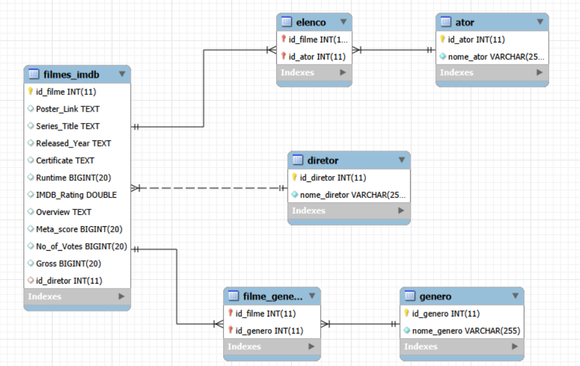

# 🎬 IMDB Top 1000: Modelagem e Normalização de Banco de Dados

## 📌 Sobre o Projeto
Este projeto consiste na construção de um pipeline de dados completo, transformando um dataset desnormalizado de filmes (IMDB Top 1000) em um banco de dados relacional robusto na **Terceira Forma Normal (3FN)**. 

O projeto aborda desde a extração e limpeza dos dados brutos até a modelagem estrutural (Diagrama ER) e a criação de consultas SQL avançadas para análise de dados cinematográficos. Desenvolvido como trabalho prático para a disciplina de Fundamentos de Banco de Dados.

## 🛠️ Tecnologias Utilizadas
* **Python & Pandas:** Extração, limpeza e formatação dos dados brutos via script automatizado.
* **MySQL & MySQL Workbench:** Sistema de Gerenciamento de Banco de Dados (SGBD) utilizado para estruturação, armazenamento e consultas.
* **SQL:** DDL (criação de tabelas e constraints), DML (cargas de dados) e DQL (consultas complexas).

## 🗄️ Modelagem de Dados (3FN)
A partir de uma única tabela desnormalizada (`filmes_imdb`), o banco foi decomposto nas seguintes entidades para eliminar redundâncias e garantir a integridade referencial:

* **Tabelas de Domínio:** `Diretor`, `Ator`, `Genero`
* **Tabela Principal:** `filmes_imdb` (conectada ao Diretor via chave estrangeira 1:N)
* **Tabelas Associativas (Pontes N:M):** `Elenco` (Filme ↔ Ator) e `Filme_Genero` (Filme ↔ Gênero)

> 

## 🔍 Consultas Avançadas
O projeto inclui um módulo de análise de dados com queries complexas abrangendo:
* **Agregações e Agrupamentos (`GROUP BY`, `HAVING`):** Identificação dos diretores mais rentáveis da história.
* **Junções Múltiplas (`JOIN` em 4 tabelas):** Mapeamento da versatilidade dos atores através dos gêneros cinematográficos.
* **Subconsultas:** Filtragem de filmes com arrecadação estritamente superior à média global.
* **Operadores de Conjunto (`UNION`):** Construção de fichas técnicas unificadas de profissionais por filme.

## 🚀 Como Executar o Projeto
Os scripts SQL foram construídos para serem **idempotentes** e modulares. Para reproduzir o banco de dados localmente:

1. Execute o script `01_criacao_desnormalizada.sql` para criar o banco de dados e a tabela bruta.
2. Execute o script `02_carga_desnormalizada.sql` para popular a tabela original com os 1000 filmes.
3. Execute o script `03_normalizacao.sql` para decompor a base, criar as chaves primárias/estrangeiras e migrar os dados para a estrutura em 3FN.
4. Execute `04_consultas.sql` para visualizar as análises gerenciais.
